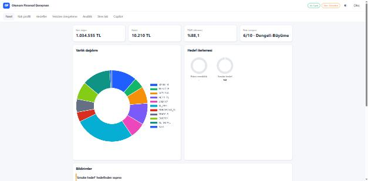
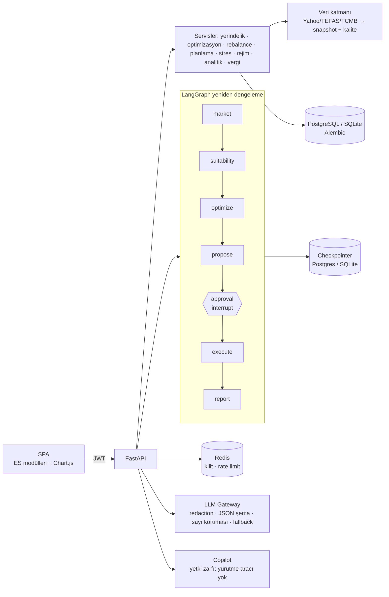

# Otonom Finansal Danışman v2


Türkiye piyasası için **tek geliştiricinin yazdığı bir robo-danışman prototipi**: yerindelik
profillemesi, TL varlıklarla çoklu varlık optimizasyonu (HRP · Black-Litterman · min-CVaR · risk
paritesi · kısıtlı MVO), enflasyon ve kur farkında hedef planlama, göreli bantlı ve minimum
devirli yeniden dengeleme, öneri → **insan onayı** → simüle yürütme akışı, ledger tabanlı
performans ölçümü ve sayıları veriyle doğrulanan LLM yorumu.

> **English summary.** A single-developer robo-advisor prototype for the Turkish market:
> suitability profiling, multi-asset optimisation against the real TL policy rate, walk-forward
> backtests with benchmarks, a GIPS-style ledger performance engine (TWR/MWR), relative drift
> bands with a minimum-turnover LP, a LangGraph human-approval interrupt, and LLM commentary whose
> numbers are checked against the data. Market data are real (Yahoo Finance, TEFAS, TCMB) and
> shipped as an offline snapshot; without an LLM key it runs in a deterministic demo mode. It is
> **not** connected to any broker or custodian.



## Çalıştır

```bash
docker compose up --build          # http://localhost:8000  (api + PostgreSQL + Redis)
```

İlk açılışta migration'lar çalışır, referans veri ve **demo verisi** yüklenir.

| Kullanıcı | Şifre | Rol |
|---|---|---|
| `demo.genc` | `Demo!2345` | Müşteri — genç profesyonel, agresif |
| `demo.ev` | `Demo!2345` | Müşteri — ev almak isteyen, orta risk |
| `demo.emekli` | `Demo!2345` | Müşteri — emekliliğe yakın, muhafazakâr |
| `danisman` | `Danisman!2345` | Danışman — onay kuyruğu, BL görüşleri, denetim |
| `admin` | `Admin!2345` | Yönetici (yalnızca demo/dev; prod'da `ADMIN_PASSWORD` zorunlu) |

Yerel geliştirme: `pip install -r requirements-dev.txt && python main.py` (SQLite, tek süreç).
Doğrulama: `python scripts/e2e_smoke.py --base http://localhost:8000`.

## Veri ve LLM

| | Varsa | Yoksa |
|---|---|---|
| **Veri** | `DATA_MODE=auto`: Yahoo Finance canlı; fonlar snapshot'tan | `data/snapshots`: gerçek kaynaklardan üretilmiş offline snapshot (2016-09 → 2026-09, 26 enstrüman) |
| **LLM** | `.env` → `LLM_API_KEY` (+ `LLM_BASE_URL`, `LLM_MODEL`; OpenAI uyumlu uç nokta) | Deterministik **demo** modu (gerçek sayılardan Türkçe şablonlar) |

Snapshot `python scripts/fetch_real_data.py` ile yeniden üretilir: BIST ve kurlar Yahoo
Finance'ten, fon fiyatları **TEFAS**'tan (TI1, TZV, YOT, YBE, IPV, TTA), TÜFE ve politika faizi
**TCMB**'den. TEFAS en fazla 5 yıl verdiği için sınıf temsilcisi fonların 2021-09 öncesi kısmı
belgelenmiş vekildir ve metadata'da `proxy_until` ile işaretlidir. Kaynaklar, vekiller, veri
kalitesi kontrolleri ve lisans notları: [DATA](docs/DATA.md). Arayüzdeki **Veri**, **Veri
kalitesi** ve **AI** rozetleri `/api/v1/system/status`'tan gerçek durumu gösterir.

Canlı LLM çağrısı hata verirse (timeout/429/5xx/geçersiz JSON/sayı uyuşmazlığı) o çağrı demo
çıktısına düşer ve `llm_mode: "fallback"` ile işaretlenir. Anahtar hiçbir log/yanıtta görünmez;
LLM emir vermez ve sayı üretmez.

## Neler var (kısa)

* **Performans:** tek ledger motoru — işlem ve nakit akışlarını değerleme günlerine taşır (hafta
  sonu akışları kaybolmaz), yalnız yatırma/çekmeyi dış akış sayar, `twr_cumulative`,
  `twr_annualized`, `mwr_annualized` ve dönem bilgisini ayrı ayrı verir.
* **Backtest:** optimizer'lı backtest'ler walk-forward çalışır (her tarihte yalnız geçmiş veri);
  XU100, TÜFE+%3 ve 60/40 ölçütleriyle aynı dönemde raporlanır. 10 seviyenin sonuçları:
  [MODEL_PORTFOLIOS](docs/MODEL_PORTFOLIOS.md).
* **Rebalance:** `min(%5, max(%0,5; %25 × hedef))` enstrüman bandı + %3 sınıf bandı, önce nakit,
  maliyet/stopaj önizlemeli minimum devir LP'si.
* **Risk:** varlık sınıfı bazında Euler risk katkıları ve BIST/USDTRY/TL faiz faktör modeli.
* **Vergi (bilgi amaçlı):** FIFO/HIFO lot motoru, gerçekleşen kâr/zarar, satış ve zarar hasadı
  simülasyonu.
* **Güvenlik:** JWT + her istekte DB'den rol doğrulama, yabancı kayda 404, prod'da zayıf sır/eksik
  PII anahtarıyla başlamama, Redis ile paylaşılan kilit ve rate limit, hash zincirli denetim izi.

## İlham alınan desenler

Bu proje aşağıdaki ürünlerin **kamuya açık anlatılarından** ilham alır; onlarla eşdeğer olduğu
iddia edilmez.

| Desen | Nereden | Bu projedeki karşılığı |
|---|---|---|
| Göreli + mutlak drift bandı, önce yeni nakitle dengeleme | Betterment tarzı rebalancing | `services/rebalancing/engine.py` |
| Vergi zararı hasadı fikri | Wealthfront / Betterment tarzı TLH | Bilgi amaçlı simülasyon (`services/tax_engine.py`) |
| Görüşlerle dengeden sapma | Black-Litterman, Idzorek güven yöntemi | `services/optimization/strategies.py` |
| Hiyerarşik risk paritesi | López de Prado (2016) | HRP + sınıf kısıtları |
| Zaman ağırlıklı getiri, dış akış tanımı | GIPS | `services/analytics/engine.py` |
| İnsan onayıyla yürütme | Danışmanlık akışları | LangGraph interrupt + idempotent onay |

## Sınırlamalar

* **Gerçek aracı kurum / saklama entegrasyonu yok.** Emirler simüle broker'da dolar
  (`services/rebalancing/broker.py`); gerçek emir iletimi, takas, mutabakat yoktur.
* **Tek geliştirici prototipi.** Kod incelemesi, güvenlik testi (pentest), yük/ölçek testi ve
  operasyonel izleme üretim düzeyinde yapılmadı. Çoklu örnek desteği (Redis kilidi, Postgres
  checkpointer) test edildi ama zamanlanmış işler (APScheduler) hâlâ tek örnekte çalışmalıdır.
* **Vergi motoru basitleştirilmiş.** Stopaj oranları politika dosyasındaki örnek tablodur; fon
  türü, elde tutma süresi istisnaları ve mahsup kuralları gerçek mevzuatın tamamını yansıtmaz.
* **Veri:** TEFAS 5 yıl verdiği için 2021-09 öncesi fon getirileri vekildir; gram altın iç piyasa
  primini içermez; 2017–2018 politika faizi GLP oranıyla yaklaşıklanır; mevduat faizi yok. Veriler
  yeniden dağıtım lisansıyla değil, çevrimdışı demo için önbellek olarak tutulur
  ([DATA](docs/DATA.md#lisans-ve-atıf)).
* **Model riski:** beklenen getiriler tarihsel veriden (James-Stein büzme) tahmin edilir;
  walk-forward sonuçları tek bir yüksek enflasyonlu dönemi kapsar ve geleceği göstermez.
* **Mevzuat:** yerindelik testi ve KVKK önlemleri resmî metinlerden ilham alan yaklaşıklamalardır;
  hukuki uyum değerlendirmesi yapılmamıştır ([COMPLIANCE](docs/COMPLIANCE.md)).
* **LLM:** yorumlar sayı korumasından geçer ama dil modeli çıktısıdır; yatırım kararı için
  kullanılmamalıdır.

## Mimari



Ayrıntılar: [ARCHITECTURE](docs/ARCHITECTURE.md) · [METHODOLOGY](docs/METHODOLOGY.md) ·
[DATA](docs/DATA.md) · [COMPLIANCE](docs/COMPLIANCE.md) · [MODEL_PORTFOLIOS](docs/MODEL_PORTFOLIOS.md) ·
[ADR'ler](docs/adr/) · [FINAL_REPORT_v2](docs/FINAL_REPORT_v2.md).

## Geliştirme

```bash
make lint typecheck cov      # ruff · mypy (sıkılaştırılmış) · pytest --cov
make snapshot                # gerçek veriden snapshot'ı yeniden üret (ağ gerekir)
python scripts/model_portfolio_report.py   # 10 seviyenin walk-forward raporu
alembic revision --autogenerate -m "..."
```

Testler ağa çıkmaz (soket koruması), gerçek `.env` anahtarını kullanmaz ve snapshot ile çalışır.
Tarayıcı uçtan uca testleri `tests/e2e` altındadır (Playwright kurulu değilse atlanır).

## Yasal uyarı

Bu yazılım bir portföy (CV) projesidir. **Bilgi amaçlıdır, yatırım tavsiyesi değildir. Gerçek
yatırım danışmanlığı SPK lisanslı kuruluşlarca verilir.** Vergi ve maliyet oranları
yapılandırmadandır ve örnektir; güncel mevzuatı kontrol edin.

Lisans: [MIT](LICENSE).
