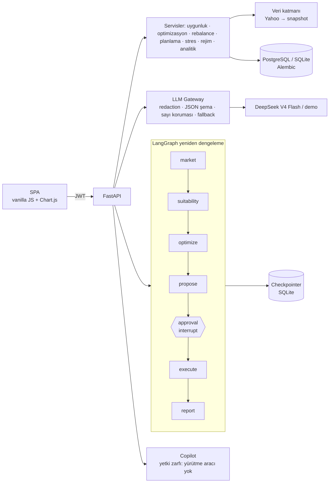

# Otonom Finansal Danışman v2


**Kurumsal seviyede dijital varlık yönetimi platformu** — SPK uygunluk testi, çoklu varlık sınıfı
optimizasyonu (HRP · Black-Litterman · CVaR · risk paritesi), enflasyon ve kur farkında hedef
planlama, bant + minimum devir hızlı yeniden dengeleme, öneri → **insan onayı** → yürütme
akışı, açıklanabilir öneriler, stres laboratuvarı ve **verilerle topraklanmış** LLM yorumu ile
yetki zarflı ajan Copilot.

> **English summary.** A production-style robo-advisor for the Turkish market: SPK suitability
> profiling, multi-asset optimisation with a real TL risk-free rate, inflation/FX-aware goal
> Monte Carlo, minimum-turnover band rebalancing with cost/tax previews, a LangGraph
> human-in-the-loop approval interrupt, explainable recommendations, stress testing, grounded
> LLM commentary (numbers are verified against the data) and a permissioned copilot. Runs
> offline (data snapshot) and without an LLM key (deterministic demo mode).


## 30 saniyede çalıştır

```bash
docker compose up --build          # http://localhost:8000  (port doluysa: API_PORT=8010)
```

İlk açılışta migration'lar çalışır, referans veri ve **demo verisi** yüklenir.

| Kullanıcı | Şifre | Rol |
|---|---|---|
| `demo.genc` | `Demo!2345` | Müşteri — genç profesyonel, agresif |
| `demo.ev` | `Demo!2345` | Müşteri — ev almak isteyen, orta risk |
| `demo.emekli` | `Demo!2345` | Müşteri — emekliliğe yakın, muhafazakâr |
| `danisman` | `Danisman!2345` | Danışman — onay kuyruğu, BL görüşleri, denetim |
| `admin` | `Admin!2345` | Yönetici (yalnızca demo/dev; prod'da `ADMIN_PASSWORD` zorunlu) |

Yerel geliştirme: `pip install -r requirements-dev.txt && python main.py` (SQLite).
Doğrulama: `python scripts/e2e_smoke.py --base http://localhost:8000`.

## LLM ve veri modları

| | Anahtar/internet varsa | Yoksa |
|---|---|---|
| **LLM** | `.env` → `LLM_API_KEY` (takma adlar: `DEEPSEEK_API_KEY`, `EVREN_API_KEY`, `OPENAI_API_KEY`) ile **canlı DeepSeek V4 Flash** (Evren) | Deterministik **demo** modu (gerçek sayılardan Türkçe şablonlar) |
| **Veri** | Yahoo Finance canlı (`DATA_MODE=auto`) | `data/snapshots` offline snapshot (10 yıl, 23 enstrüman) |

`.env` aranma sırası: `Anil1/.env` → `../.env`. Başlangıç logu `llm_mode=live model=deepseek-v4-flash`
veya `llm_mode=demo reason=no_api_key` der; `python scripts/llm_smoke.py` tek gerçek çağrı yapar.
Canlı çağrı hata verirse (timeout/429/5xx/geçersiz JSON/sayı halüsinasyonu) o çağrı demo
çıktısına düşer ve `llm_mode: "fallback"` ile işaretlenir. Anahtar hiçbir log/yanıtta görünmez.
UI başlığında **AI: Canlı/Demo** ve **Veri: Canlı/Önbellek** rozetleri vardır.

## Mimari



Ayrıntılar: [ARCHITECTURE](docs/ARCHITECTURE.md) · [METHODOLOGY](docs/METHODOLOGY.md) ·
[COMPLIANCE](docs/COMPLIANCE.md) · [DEMO_SCRIPT](docs/DEMO_SCRIPT.md) · [ADR'ler](docs/adr/) ·
[FINAL_REPORT](docs/FINAL_REPORT.md).

## Sektör kıyası

| Yetkinlik | Wealthfront / Betterment / Aladdin Wealth | Bu proje |
|---|---|---|
| Risk profilleme | Dijital anket | SPK III-37.1: bilgi/deneyim, kapasite ≠ tolerans, tutarlılık kontrolü, 12 ay geçerli versiyonlu profil |
| Varlık evreni | ETF'ler | BIST hisse/endeks, TL para piyasası & tahvil, eurobond, gram altın, USD/EUR |
| Optimizasyon | Kısıtlı MVO, BL | HRP, Black-Litterman (Idzorek), min-CVaR LP, risk paritesi, kısıtlı MVO; gerçek TL rf |
| Rebalance | Bant, önce nakit | Sınıf bantları + L1 min-devir LP, önce nakit, maliyet & stopaj önizleme, zamanlanmış |
| Hedef planlama | Monte Carlo | Blok bootstrap (kur+altın+TÜFE birlikte), reel/nominal bantlar, tam gerekli katkı |
| Yönetişim | Onay, audit | LangGraph interrupt, idempotency, portföy kilidi, hash-zincirli audit |
| GenAI | Auto Commentary | Sayı korumalı yorum + 6 adımlı, denetlenen, yürütme yetkisiz Copilot |

## Geliştirme

```bash
make lint typecheck cov      # ruff · mypy · pytest --cov
make snapshot                # offline veriyi yenile (EVDS_API_KEY varsa gerçek TÜFE/faiz)
alembic revision --autogenerate -m "..."
```

Testler ağa çıkmaz (soket koruması), gerçek `.env` anahtarını kullanmaz ve snapshot ile çalışır.

## Yasal uyarı

Bu yazılım bir portföy projesidir. **Bilgi amaçlıdır, yatırım tavsiyesi değildir. Gerçek yatırım
danışmanlığı SPK lisanslı kuruluşlarca verilir.** Vergi ve maliyet oranları yapılandırmadandır,
bilgi amaçlıdır; güncel mevzuatı kontrol edin. Proxy fon serileri gerçek fon getirilerini
birebir yansıtmaz; TÜFE/faiz serileri EVDS anahtarı yokken yaklaşıktır.

Lisans: [MIT](LICENSE).
