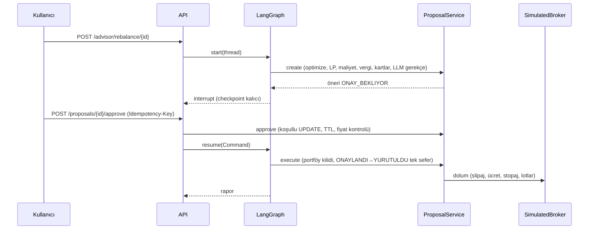

# Mimari

## Katmanlar

| Katman | Paketler | Sorumluluk |
|---|---|---|
| API | `routers/`, `core/app.py`, `core/middleware.py`, `core/deps.py` | FastAPI, JWT, sahiplik kontrolü, rate limit, güvenlik başlıkları, request-id, hata gizleme |
| DI | `core/container.py` | Paylaşılan servisler: veri (TTL cache), LLM gateway, optimizer, öneri servisi, planlayıcı, advisor grafı |
| Ajanlar | `agents/` | LangGraph akışı (market → suitability → optimize → propose → approval → execute → report), Copilot |
| Alan servisleri | `services/` | uygunluk, optimizasyon, rebalance (motor, maliyet/vergi, broker, öneriler), planlama, analitik, rejim, stres, davranış, audit |
| Veri | `services/market_data/`, `data/snapshots/` | Yahoo → snapshot zinciri, proxy türetme, makro seriler |
| LLM | `llm/` | istemciler, deterministik demo, gateway, sayı koruması, KVKK redaction, promptlar |
| Kalıcılık | `models/`, `alembic/` | SQLAlchemy 2 async, Decimal para, Fernet PII, Alembic migration |
| Politika | `config/policy.toml`, `core/policy.py` | Tüm eşikler, bantlar, maliyetler, vergi tablosu, model portföyler |

## Öneri → onay → yürütme

## Gözlemlenebilirlik

`/metrics` (Prometheus: HTTP, optimizer, MC, rebalance olayları, LLM çağrı/token/fallback, veri
kaynağı), `/health/live`, `/health/ready` (DB, veri kaynağı, zamanlayıcı), structlog JSON +
`X-Request-ID`. `llm_usage` tablosu her LLM çağrısını (içerik olmadan) kaydeder.

## Zamanlanmış işler (APScheduler)

Drift kontrolü (hafta içi 18:30), takvim kontrolü (ay/çeyrek başı), öneri süresi (15 dk), fiyat
kalıcılığı, Autopilot süpürme ve dürtmeler.
