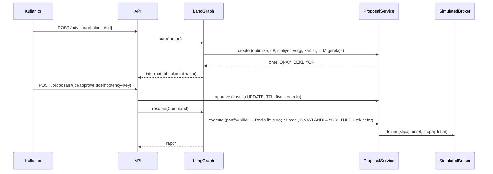

# Mimari

## Katmanlar

| Katman | Paketler | Sorumluluk |
|---|---|---|
| API | `routers/`, `core/app.py`, `core/middleware.py`, `core/deps.py` | FastAPI, JWT (rol her istekte DB'den), sahiplik kontrolü (yabancı kayıt = 404), rate limit (bellek/Redis), güvenlik başlıkları, request-id, hata gizleme |
| DI | `core/container.py`, `core/locks.py` | Paylaşılan servisler: veri (TTL cache), LLM gateway, optimizer, öneri servisi, planlayıcı, advisor grafı, kilit yöneticisi (bellek/Redis) |
| Ajanlar | `agents/` | LangGraph akışı (market → suitability → optimize → propose → approval → execute → report), Copilot |
| Alan servisleri | `services/` | yerindelik, optimizasyon, rebalance (göreli bantlı motor, maliyet/vergi, broker, öneriler), planlama, analitik (tek ledger performans motoru, walk-forward, risk ayrıştırma, model portföy takibi), vergi lot motoru, rejim, stres, davranış, audit |
| Veri | `services/market_data/`, `data/snapshots/`, `scripts/fetch_real_data.py` | Yahoo → snapshot zinciri; snapshot Yahoo/TEFAS/TCMB'den üretilir; veri kalitesi denetimi; vekil yalnız TEFAS öncesi dönem |
| LLM | `llm/` | istemciler, deterministik demo, gateway, sayı koruması, kişisel veri redaksiyonu, promptlar |
| Kalıcılık | `models/`, `alembic/` | SQLAlchemy 2 async, Decimal para, Fernet PII, Alembic migration |
| Politika | `config/policy.toml`, `core/policy.py` | Tüm eşikler, bantlar, maliyetler, vergi tablosu, model portföyler |

## Öneri → onay → yürütme

## Gözlemlenebilirlik

`/metrics` (Prometheus: HTTP, optimizer, MC, rebalance olayları, LLM çağrı/token/fallback, veri
kaynağı; varsayılan kapalı — `METRICS_PUBLIC=true` veya `METRICS_TOKEN`), `/health/live`,
`/health/ready` (DB, veri kaynağı, zamanlayıcı), `/api/v1/system/status` ve `/api/v1/data/quality`
(rozetler, veri kalitesi), structlog JSON + `X-Request-ID`. `llm_usage` tablosu her LLM çağrısını (içerik olmadan) kaydeder.

## Zamanlanmış işler (APScheduler)

Drift kontrolü (hafta içi 18:30), takvim kontrolü (ay/çeyrek başı), öneri süresi (15 dk), fiyat
kalıcılığı, Autopilot süpürme ve dürtmeler.

## Ölçekleme

`LOCK_BACKEND=redis` ve `RATE_LIMIT_STORAGE=redis` ile birden çok API örneği aynı portföy kilidini,
denetim zinciri kilidini ve rate limit sayaçlarını paylaşır; `DATABASE_URL` PostgreSQL ise LangGraph
checkpoint'leri de aynı veritabanında tutulur. İki uygulama örneğinin aynı öneriyi eşzamanlı
onayladığı durumda tek yürütme olduğu `tests/test_v2_security.py` ile doğrulanır. APScheduler işleri
henüz lider seçimi yapmaz; zamanlayıcı tek örnekte açık tutulmalıdır.
