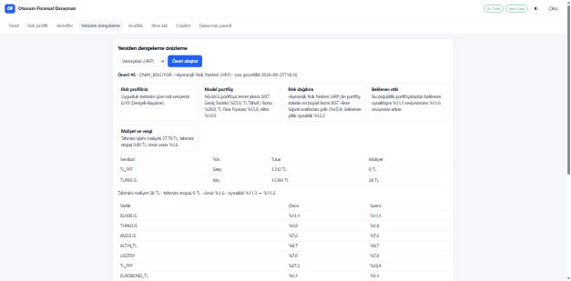

# 3 dakikalık demo akışı

1. **(0:00)** `docker compose up --build` → `http://localhost:8000`. Rozetler: **AI: Canlı** (DeepSeek)
   ve **Veri: Canlı/Önbellek**.
2. **(0:20)** `demo.genc / Demo!2345` → Panel: net değer, TWR, dağılım, hedef halkaları, dürtmeler,
   veriyle topraklanmış piyasa yorumu.
3. **(0:50)** *Risk profili*: 15 soruluk SPK anketi; çelişkili cevapta yeniden sorma.
4. **(1:10)** *Hedefler*: Monte Carlo fan grafiği, başarı olasılığı, gerekli katkı; kaydırıcılarla ya-olursa.
5. **(1:40)** *Yeniden dengeleme*: yöntem seç (HRP/BL/CVaR) → emirler, maliyet, stopaj, önce/sonra
   ağırlıklar, **Neden? kartları** → **Onayla ve yürüt** (tek sefer, idempotent).
6. **(2:10)** *Stres lab*: USDTRY +%30 ve Ağustos 2018 → P&L ve hedef olasılığına etki.
7. **(2:30)** *Copilot*: "Emekliliğime yetişir miyim?" — araç adımları akışta; yürütme yetkisi yok.
8. **(2:45)** `danisman` ile *Danışman paneli*: onay kuyruğu, BL görüşü, **zinciri doğrula**.

